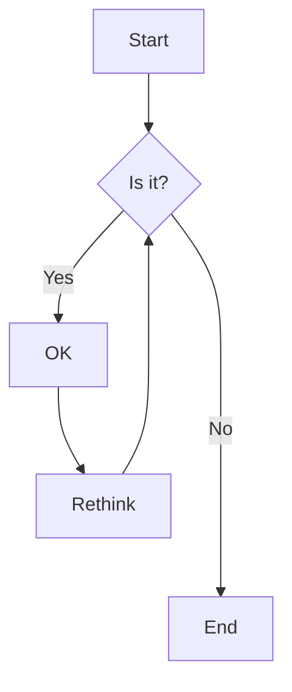

# Readme QuickStart

This is a quickStart of `syntax` in **markdown** referencing from [GitHub Guideline](https://docs.github.com/en/get-started/writing-on-github/getting-started-with-writing-and-formatting-on-github/quickstart-for-writing-on-github).


## Metadata
```
---
title: how to get things done
description: this is great
tags: filming, coding
cover_image: testing.jpg
---
```

## Code Block


```javascript
const dennis = "handsome"

```

```sh
git add
git commit -m "initial commit"
git push
```

## Table

| Rank | Languages |                   documentation |
| :--- | :-------: | ------------------------------: |
| 1    |   rust    |             https://go.dev/doc/ |
| 2    |    go     | https://www.rust-lang.org/learn |


## Collapsible

<details>
<summary>Languages to learn</summary>

| Rank | Language |
| ---- | -------- |
| 1    | rust     |
| 2    | go       |


</details>

<details>
<summary>My top languages</summary>

1. Typescript
2. Python

</details>
---

## Quote
> Less is More.

— mies van der rohe

<!-- this is a comment. Not showing in preview-->


## Diagram

[Mermaid.js](http://mermaid.js.org/intro/)



## Task List

 - [x] watch arsenal match
 - [ ] watch movie
 - [ ] watch netflix
  

## Shortcut

| Key                  | Command                      |
| -------------------- | ---------------------------- |
| Ctrl/Cmd + B         | Toggle bold                  |
| Ctrl/Cmd + I         | Toggle italic                |
| Alt+S (on Windows)   | Toggle strikethrough1        |
| Ctrl + Shift + ]     | Toggle heading (uplevel)     |
| Ctrl + Shift + [     | Toggle heading (downlevel)   |
| Ctrl/Cmd + M         | Toggle math environment      |
| Alt + C              | Check/Uncheck task list item |
| Ctrl/Cmd + Shift + V | Toggle preview               |
| Ctrl/Cmd + K V       | Toggle preview to side       |

## Image

[](https://github.com)